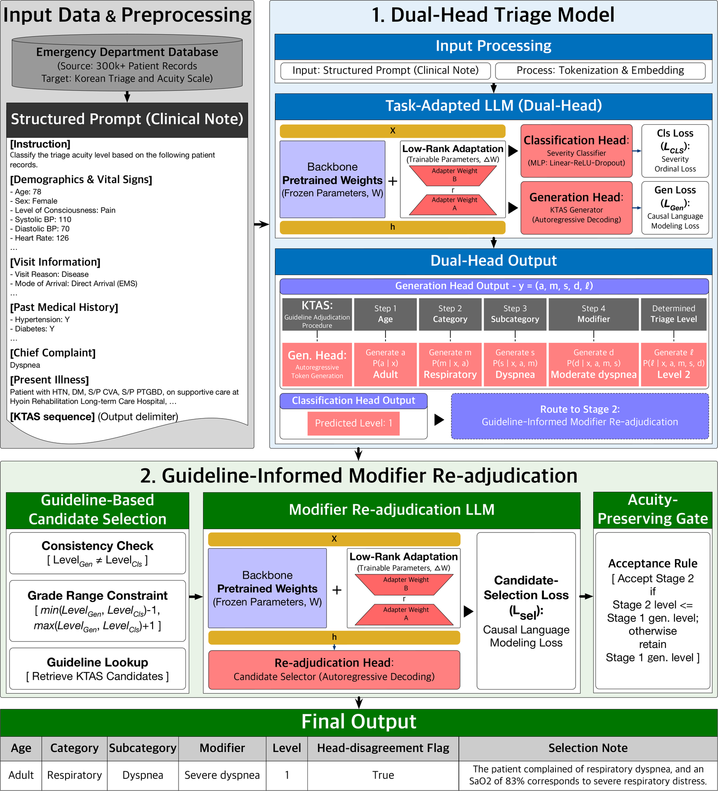

# Dr.KTAS

Reference implementation of **"Emergency Department Triage Classification Using LLM-Based Hierarchical Sequence Generation"** (Park *et al.*, submitted to *IEEE Journal of Biomedical and Health Informatics*, 2026).

Dr.KTAS formulates Korean Triage and Acuity Scale (KTAS) classification as **hierarchical adjudication-sequence generation** rather than direct prediction of the final triage level. Stage 1 trains a dual-head model (autoregressive generation head + ordinal classification head) on the complete documented adjudication pathway (age group, chief-complaint category, subcategory, clinical modifier, triage level). Head-disagreement cases are routed to Stage 2 for Guideline-Informed Modifier Re-adjudication, and the selected output is accepted only through an acuity-preserving gate.

## Highlights

- **Protocol-aligned supervision.** The training target is the full KTAS sequence `(age group, category, subcategory, modifier, level)` rather than the final level alone.
- **Dual-head Stage 1.** Generation head + classification head share a single LoRA-adapted backbone (Ministral-8B-Instruct-2410, 4-bit QLoRA).
- **Stage 2 modifier re-adjudication.** A separate LoRA adapter selects among guideline-aligned modifier candidates only for head-disagreement cases.
- **Acuity-preserving gate.** Stage 2 output is accepted only when the selected level is the same as or more urgent than the Stage 1 generation output.
- **Same-protocol external evaluation.** Trained on Chonnam National University Hospital (CNUH); evaluated on Wonkwang University Hospital (WKU) without retraining.

## Framework overview



*Overview of the Dr.KTAS framework. Stage 1 generates the full KTAS adjudication sequence and independently predicts the triage level from the shared representation. Head-agreement cases accept the generation output, whereas head-disagreement cases are routed to Stage 2 for Guideline-Informed Modifier Re-adjudication. The selected Stage 2 output is then accepted only through the acuity-preserving gate. (Figure 2 in the paper.)*

## KTAS guidelines

The two lookup tables in [`guidelines/`](https://github.com/dol-paper-code/DrKTAS/tree/main/guidelines) encode the deterministic `(category, subcategory, modifier) → level` mapping used by Dr.KTAS for Stage 2 candidate retrieval and the acuity-preserving gate. They are derived from the official Korean Triage and Acuity Scale (KTAS) reference materials:

- **Regulatory standard.** Ministry of Health and Welfare of Korea. *Korean Triage and Acuity Scale Standard.* MOHW Notice No. 2023-287, December 2023 (effective December 28, 2023).
- **Scale validation.** Kwon, H., Kim, Y. J., Jo, Y. H., Lee, J. H., Lee, J. H., Kim, J., Hwang, J. E., Jeong, J., & Choi, Y. J. (2019). The Korean Triage and Acuity Scale: associations with admission, disposition, mortality and length of stay in the emergency department. *International Journal for Quality in Health Care*, 31(6), 449–455. <https://doi.org/10.1093/intqhc/mzy184>
- **Underlying scale.** KTAS is adapted from the Canadian Triage and Acuity Scale: Bullard, M. J., Musgrave, E., Warren, D., Unger, B., Skeldon, T., Grierson, R., van der Linde, E., & Swain, J. (2017). Revisions to the Canadian Emergency Department Triage and Acuity Scale (CTAS) Guidelines 2016. *CJEM*, 19(S2), S18–S27. <https://doi.org/10.1017/cem.2017.365>
- **Maintaining body.** KTAS Committee (Korean Society of Emergency Medicine), <https://www.ktas.org>.

Each entry in the JSON files has the fields `Lv3exp` (subcategory description), `Lv4exp` (clinical modifier description) and `severity` (KTAS level 1–5). The adult table contains 2,016 classification rules and the pediatric table contains 2,351, matching the counts reported in Section III of the paper.

The lookup tables are released here for research reproducibility. Any clinical use of KTAS in Korea must follow the version of the standard in force at the time of use, which is maintained by the KTAS Committee.

## Repository layout

```
DrKTAS/
├── guidelines/        # KTAS adult/children guideline lookup tables (released)
├── prompts/           # Prompt templates loaded by the scripts at run-time
├── src/drktas/        # Core library (model, data, losses, metrics, gate, prompts loader)
├── scripts/           # CLI entry points (train, prepare, infer, evaluate)
├── configs/           # YAML configs reproducing paper Tables II and III
├── figures/           # Scripts that reproduce paper figures from result CSVs
├── docs/              # Reproducibility guide, architecture, data governance
└── archived/          # Older versions kept for provenance only
```

No clinical data files are distributed in this repository. The pipeline
reads CSV inputs that follow the column schema documented in
`docs/data_governance.md`; users supply their own data files outside the
repository.

## Quick start

```bash
# 1. Environment
python -m venv .venv && source .venv/bin/activate
pip install -r requirements.txt

# 2. Stage 1 — Dr.KTAS dual-head with full adjudication-sequence supervision
torchrun --nproc_per_node=4 scripts/stage1_train.py \
    --config configs/stage1_dual_head.yaml \
    --train_data /path/to/your_train.csv \
    --output_dir runs/stage1_dual_head

# 3. Stage 2 data — generate Step 1 calibration data from Stage 1 predictions
python scripts/stage2_prepare_data.py \
    --config configs/stage2_readjudication.yaml \
    --train_predictions runs/stage1_dual_head/train_predictions.csv \
    --output_dir data_stage2/

# 4. Stage 2 — fine-tune the re-adjudication LoRA adapter
python scripts/stage2_train.py \
    --config configs/stage2_readjudication.yaml \
    --train_data data_stage2/train.jsonl \
    --val_data data_stage2/val.jsonl \
    --output_dir runs/stage2_readjudication

# 5. End-to-end inference with acuity-preserving gate
python scripts/stage2_infer.py \
    --config configs/stage2_readjudication.yaml \
    --stage1_predictions runs/stage1_dual_head/test_predictions.csv \
    --lora_adapter runs/stage2_readjudication/final_adapter \
    --output_dir runs/drktas_final/
```

See `docs/reproduce.md` for the full reproduction recipe of the four ablations (Triage-level, Triage-full context, Classification-only, Dual-Head) and Dr.KTAS, and `docs/architecture.md` for a walk-through of the model and pipeline.

## Data availability

Raw clinical notes from CNUH and WKU **cannot be shared** due to institutional data-governance restrictions (IRB CNUH-2025-041 & 049; DRB CNUH-D-2025-8; WKUH IRB 2025-03-040-003). Only the KTAS guideline lookup tables in `guidelines/` and the prompt templates in `prompts/` are released. No clinical data — real or synthetic — is included in the repository.

Researchers with a formal Data Use Agreement may request derivative artifacts (de-identified evaluation pipeline, model checkpoints) by contacting the corresponding author. See `docs/data_governance.md` for details.

## Citation

If you use this code or build on this work, please cite:

```bibtex
@article{park2026drktas,
  title   = {Emergency Department Triage Classification Using LLM-Based Hierarchical Sequence Generation},
  author  = {Park, Hwin Dol and Kim, Dohyeun and Choi, Jae Hun and Kim, Dong Ki and Cho, Yong Soo and Lee, Uichin},
  journal = {IEEE Journal of Biomedical and Health Informatics},
  year    = {2026},
  note    = {Submitted}
}
```

See also `CITATION.cff` in this repository.

## Acknowledgments

This work was supported in part by the Institute of Information & Communications Technology Planning & Evaluation grant No. 2021-0-00982 and the Korean ARPA-H Project grant No. RS-2024-00512237.

## License

MIT — see `LICENSE`.

## Corresponding author

Uichin Lee — uclee@kaist.ac.kr
